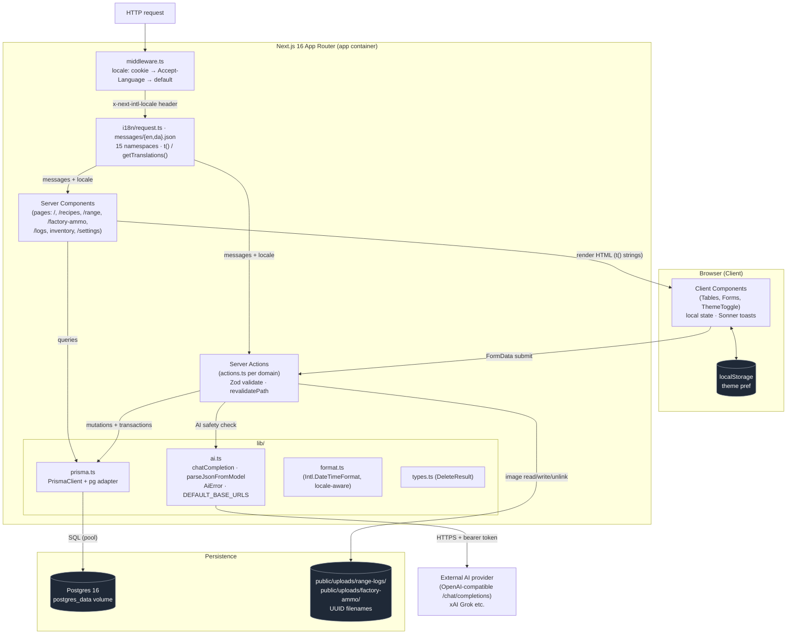
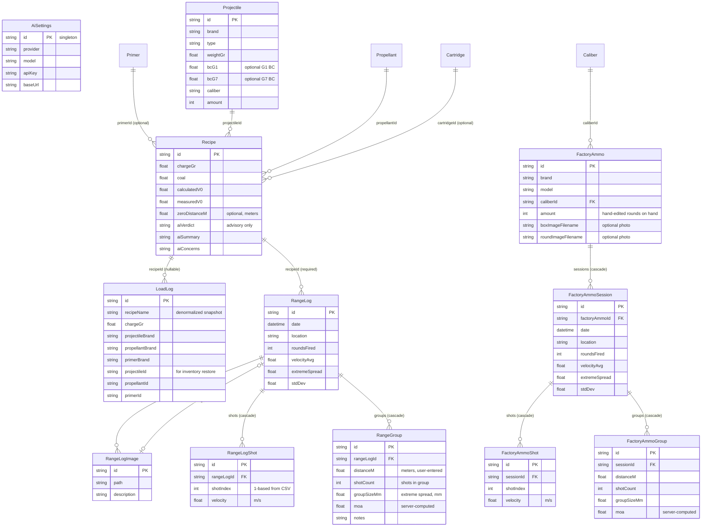
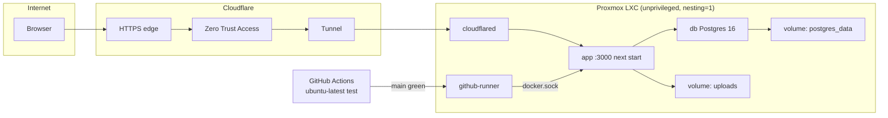

# Architecture

Diagrams describing the architecture of the reloading project.

## High-level architecture



## Data model (Prisma schema)



## Key flows

```mermaid
sequenceDiagram
    participant U as Client Form
    participant A as Server Action
    participant DB as Postgres
    participant FS as uploads/
    participant AI as AI Provider

    rect rgb(30,41,59)
    note over U,DB: LoadLog create — snapshot + transaction
    U->>A: FormData (recipe, qty)
    A->>DB: fetch recipe + components
    A->>DB: TX: insert denormalized snapshot<br/>+ deduct inventory (grain→gram)
    A-->>U: revalidate + toast
    end

    rect rgb(30,41,59)
    note over U,FS: RangeLog edit — photos
    U->>A: FormData (files + descriptions,<br/>existing markedForDelete)
    A->>FS: write UUID files / unlink deleted
    A->>DB: upsert RangeLog + images
    A-->>U: redirect to readonly detail
    end

    rect rgb(30,41,59)
    note over U,A: Chronograph CSV import (Xero C1)
    U->>U: select CSV → parseChronographCsv (client)
    U->>U: preview shots + auto-fill velocity fields
    U->>A: FormData (shots JSON + replaceShots)
    A->>A: shotsSchema.safeParse + recompute aggregates
    A->>DB: TX: upsert RangeLog + deleteMany/insertMany RangeLogShot
    A-->>U: revalidate + redirect to detail
    end

    rect rgb(30,41,59)
    note over U,AI: Recipe AI safety check
    U->>A: runRecipeAiCheckOnInput / byId
    A->>DB: read AiSettings (singleton) + recipe
    A->>AI: chatCompletion (non-null fields only)
    AI-->>A: JSON verdict (defensive parse)
    A->>DB: persist aiVerdict/Summary/Concerns
    end

    rect rgb(30,41,59)
    note over U,FS: FactoryAmmo create — box + round photos
    U->>A: FormData (brand/model/caliber/amount + boxImage + roundImage)
    A->>A: createFactoryAmmoSchema.safeParse + resolveCaliberId
    A->>FS: write UUID files to uploads/factory-ammo/
    A->>DB: insert FactoryAmmo (filename columns only)
    A-->>U: redirect to /factory-ammo/[id]
    end

    rect rgb(30,41,59)
    note over U,DB: FactoryAmmoSession — chrono import + groups
    U->>U: select CSV → ChronographImport (namespace=factoryAmmo)
    U->>A: FormData (shots JSON + groups JSON + replaceShots/replaceGroups)
    A->>A: shotsSchema + groupsSchema.safeParse; recompute aggregates + MOA
    A->>DB: TX: upsert FactoryAmmoSession + deleteMany/insertMany shots + groups
     A-->>U: redirect to session detail
     end
```

## Production deployment

Dev (`docker-compose.yml`) stays on Docker Desktop. Production is a separate compose project (`reloading-prod` / `docker-compose.prod.yml`) on a dedicated Proxmox LXC.



- `Dockerfile.prod` multi-stage: pnpm install → `prisma generate` → `next build` → runtime image. Entrypoint: `prisma migrate deploy` then `pnpm start`.
- Photos persist on the `uploads` named volume mounted at `/app/public/uploads`. Without it, range/factory-ammo images vanish on every container recreate.
- Deploy replaces **only** `reloading-app`. `db`, `cloudflared`, and `github-runner` stay up. `docker system prune -a -f` after each deploy to keep the LXC disk alive.
- No inbound ports on the LXC. TLS terminates at Cloudflare. Access is the login gate; the Next.js app has no authentication of its own.
